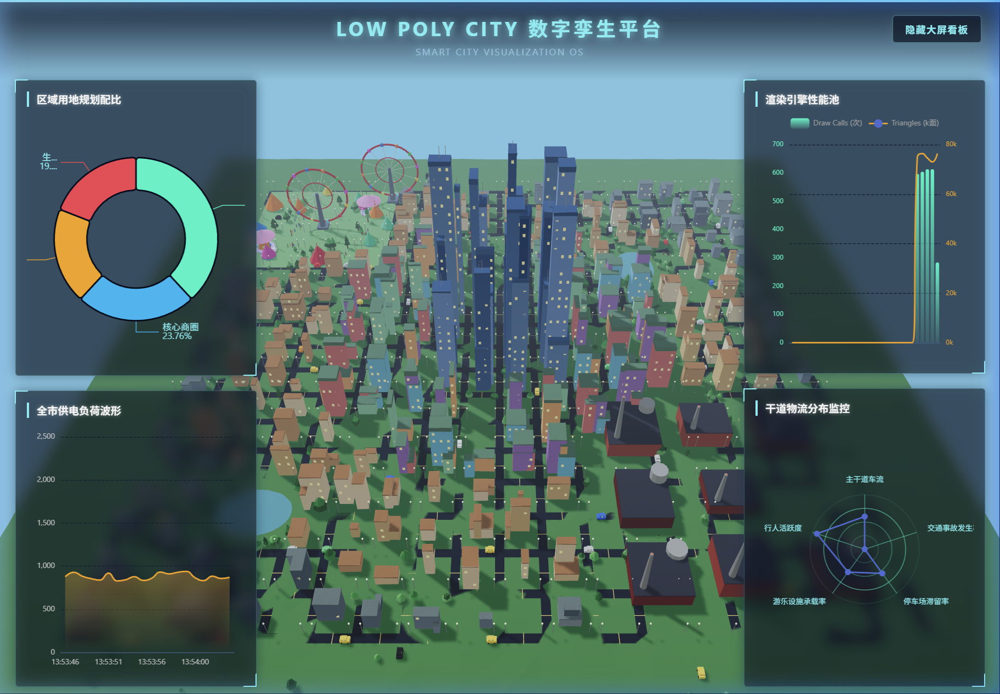

<p align="center">
  
</p>

<h1 align="center">🏙️ Low Poly City · 数字孪生城市可视化平台</h1>

<p align="center">
  <strong>一座完全由算法程序化生成的低多边形 3D 赛博城市，搭配工业级实时数据大屏。</strong>
</p>

<p align="center">
  <a href="https://dreamlong1.github.io/LowPolyCity/">🌐 在线体验 Live Demo</a> ·
  <a href="#-快速启动">🚀 快速启动</a> ·
  <a href="#-技术架构">🏗️ 技术架构</a>
</p>

<p align="center">
  
  
  
  
</p>

---

## ✨ 项目概览

**Low Poly City** 是一个纯前端技术栈驱动的智慧城市数字孪生可视化项目。无需任何后端服务，仅凭浏览器即可实时渲染一座拥有**数百栋建筑、数十辆穿梭车辆、近百名街头行人**以及自然湖泊、主题公园和工业厂区的完整城市沙盘。

项目同时在 3D 场景上叠加了一套**完全解耦的 ECharts 数据大屏系统**，实时展示城市运营的关键指标，形成"3D 底座 + 2D 信息层"的经典数字孪生架构。

---

## � 交互操控

| 操作 | 方式 |
|:---:|:---|
| **旋转视角** | 鼠标左键按住拖拽 |
| **缩放镜头** | 鼠标滚轮上下滚动 |
| **平移画面** | 鼠标右键按住拖拽 |
| **切换昼夜** | 点击左下角的 ☀️ 白天 / 🌆 黄昏 / 🌙 夜晚 按钮 |
| **隐藏数据面板** | 点击右上角「隐藏大屏看板」按钮，进入沉浸式全景模式 |

---

## 🚀 快速启动

### 环境要求

- [Node.js](https://nodejs.org/) >= 18.x（含 npm）

### 安装与运行

```bash
# 1. 克隆仓库
git clone https://github.com/dreamlong1/LowPolyCity.git
cd LowPolyCity

# 2. 安装依赖
npm install

# 3. 启动开发服务器（支持 HMR 热更新）
npm run dev

# 4. 构建生产版本
npm run build
```

启动后在浏览器中打开 `http://localhost:5173` 即可体验。

---

## 🏗️ 技术架构

```
┌─────────────────────────────────────────────────────────┐
│                     index.html                          │
│  ┌────────────────────┐   ┌──────────────────────────┐  │
│  │   Three.js Canvas  │   │  ECharts Dashboard Layer │  │
│  │   (z-index: 1)     │   │  (z-index: 100)          │  │
│  └────────┬───────────┘   └────────────┬─────────────┘  │
│           │                            │                │
│     ┌─────┴─────┐              ┌───────┴───────┐       │
│     │  main.js  │──event──────>│ dashboard.js  │       │
│     └─────┬─────┘              └───────────────┘       │
│           │                                             │
│   ┌───────┼───────────────┐                             │
│   │       │               │                             │
│ config  world.js     entities.js                        │
│   │    (静态地形)    (动态实体)                           │
│   │   ┌────────┐   ┌──────────┐                         │
│   │   │建筑合批│   │InstancedMesh│                      │
│   │   │湖泊水域│   │行人系统    │                        │
│   │   │路网铺设│   │游乐设施    │                        │
│   │   └────────┘   └──────────┘                         │
│   │                                                     │
│ materials.js  ←  utils.js                               │
│ (50+材质缓存)   (Jitter/随机)                            │
└─────────────────────────────────────────────────────────┘
```

### 模块职责

| 模块 | 文件 | 核心职责 |
|---|---|---|
| **配置中心** | `config.js` | 城市网格尺寸、公园/湖泊坐标、三套昼夜光照调色板 |
| **材质管理** | `materials.js` | 50+ 种预缓存材质（建筑/道路/植被/车辆/行人），`Map` 容器一次创建全局复用 |
| **工具函数** | `utils.js` | 随机数生成器、数组随机拾取、**顶点 Jitter 抖动算法**、加载进度条 |
| **静态世界** | `world.js` | 地形铺设、路网生成、建筑群程序化建造、湖泊/公园/路灯/帐篷，最终通过 `mergeGeometries` 合并为极少量 Mesh |
| **动态实体** | `entities.js` | InstancedMesh 车辆系统、行人 AI、摩天轮/旋转木马旋转动画 |
| **主控引擎** | `main.js` | 渲染器/相机/灯光/控制器初始化、昼夜主题切换、`requestAnimationFrame` 主循环 |
| **数据大屏** | `dashboard.js` | ECharts 图表初始化与实时数据刷新，通过 `window.onWorldDataReady` 事件与 3D 层解耦通信 |

---

## 项目结构

```
LowPolyCity/
├── index.html              # 应用入口 HTML
├── vite.config.js          # Vite 构建配置
├── package.json            # Node.js 工程依赖管理
│
├── css/
│   └── style.css           # 全局基础样式（加载动画、HUD、按钮等）
│
├── js/                     # 3D 引擎核心代码
│   ├── config.js           # 城市规划参数与光照调色板
│   ├── materials.js        # 材质工厂与颜色管理系统
│   ├── utils.js            # 随机数、Jitter 抖动、进度条工具
│   ├── world.js            # 静态世界生成（地形/建筑/路网/湖泊）
│   ├── entities.js         # 动态实体（车辆/行人/游乐设施）
│   └── main.js             # 主控引擎（渲染循环/灯光/昼夜切换）
│
├── DataScreen/             # 数据大屏模块（完全解耦）
│   ├── css/
│   │   └── dashboard.css   # 大屏专属科技风样式
│   └── js/
│       └── dashboard.js    # ECharts 图表初始化与实时刷新
│
├── docs/
│   └── preview.png         # 项目预览截图
│
└── .github/
    └── workflows/
        └── deploy.yml      # GitHub Pages 自动部署工作流
```

---

## 🎯 核心特性一览

### 🌆 程序化城市生成 (Procedural Generation)

整座城市**不依赖任何外部模型文件**，全部由算法在运行时动态生成：

| 城区类型 | 建筑风貌 | 距中心距离 |
|:---:|:---:|:---:|
| **核心 CBD** | 5~28 层拔天摩天楼，越靠中心越高 | < 2.5 格 |
| **内环高级公寓** | 3~12 层彩色赛博风格楼宇 | 2.5 ~ 5.5 格 |
| **中环居民区** | 2~8 层暖色系普通住宅 | 5.5 ~ 8.5 格 |
| **外环保底小屋** | 2~6 层灰调低矮民居 | > 8.5 格 |
| **工业厂区** | 巨型红砖厂房 + 烟囱 + 球罐储气点 | 左下远角 |

- 每栋建筑的**宽度、深度、高度、颜色**均由伪随机数独立控制，确保每次加载都是一座"崭新的城市"。
- 超高层建筑自动加装**避雷针**、厂房区自动生成**冒烟大烟囱**和**航空障碍警示灯**。

### 🎡 丰富的城市生态

- **主题公园**：位于城市东南角，包含可旋转的**摩天轮** (Ferris Wheel，8 节彩色轿厢) 与**旋转木马** (Carousel)，配有散布的野餐帐篷。
- **自然湖泊**：基于椭圆方程生成的多处水域，具有半透明波光效果，湖畔重点种植环绕绿化林。
- **路网系统**：棋盘格布局的双车道沥青公路，中心线绘有黄色分隔标记。
- **路灯照明**：每个路口部署双侧路灯杆，夜晚自动开启暖色自发光灯泡。

### 🚗 高性能动态交通系统

利用 Three.js 的 **InstancedMesh** 技术驱动 60 辆汽车在路网上实时穿梭：

```
传统方案：60 辆车 × 4 组件 = 240 Draw Calls ❌
本项目方案：4 个 InstancedMesh × 1 Draw Call = 4 Draw Calls ✅
```

- 每辆车由**车身、车顶、车轮、车头灯**四个几何组件构成，各自独立着色。
- 车辆具备**环路循环逻辑**：驶出城界后自动从对侧重新进入。
- 夜晚模式下车头灯自动增强自发光强度，模拟真实的霓虹车流效果。

### 👥 城市行人 AI

- 80 名低面像素小人分布在城市各条街道上，由**头发、皮肤头部、身体色块、双腿**五个独立 Mesh 组装而成。
- 行走时带有 `Math.sin()` 驱动的**步伐颠簸弹跳动画**，还原真实的行走韵律。
- 行人穿过湖泊区域时自动**隐身** (`mesh.visible = false`)，避免"水上漂"的违和感。

### 🌗 动态昼夜系统

一键无缝切换三种光影主题，整个场景的**天空色、雾气、环境光、太阳光、地面色、水面色、窗户发光强度**全部联动响应：

| 主题 | 天空 | 特点 |
|:---:|:---:|:---|
| ☀️ 白天 | 晴朗天蓝 | 明亮的日光直射，建筑投射锐利阴影 |
| 🌆 黄昏 | 橘红夕阳 | 暖色调渲染，窗户微弱发光 |
| 🌙 夜晚 | 深空墨蓝 | 窗格强烈发光，路灯全开，车灯霓虹闪烁 |

### 📊 数据大屏系统 (完全解耦)

大屏 UI 层通过 **CSS `pointer-events: none`** 悬浮于 3D 画布之上，不干扰底层 OrbitControls 的交互操作：

| 面板位置 | 图表类型 | 数据来源 |
|:---:|:---:|:---|
| 左上 | 南丁格尔玫瑰图 | 城市区划用地配比（CBD/公寓/居民/厂房） |
| 左下 | 实时滑动折线图 | 全市模拟供电负荷波形，昼夜联动周期变化 |
| 右上 | 柱状+折线混合图 | WebGL 渲染引擎性能池（Draw Calls / Triangles） |
| 右下 | 五维雷达图 | 干道物流分布监控（车流/行人/事故/停车场） |

- 右上角提供**一键隐藏/呼出大屏**的沉浸式开关。隐藏后按钮自动进入**极低透明度潜伏态**，悬停时才浮现，完美的无打扰观览体验。

---

## 📜 许可证

本项目基于 [MIT License](LICENSE) 开源。
